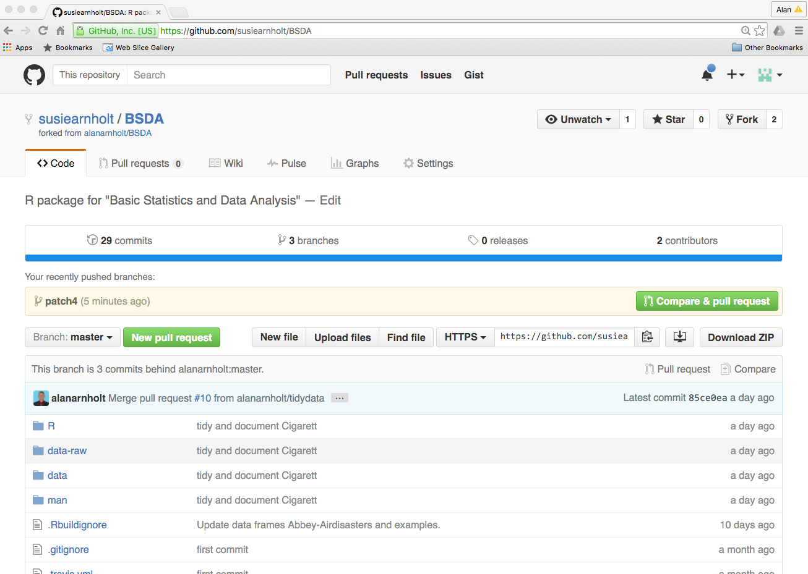
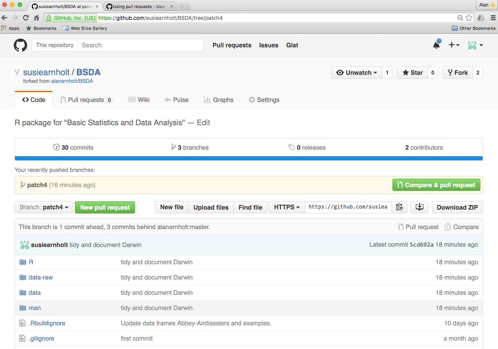
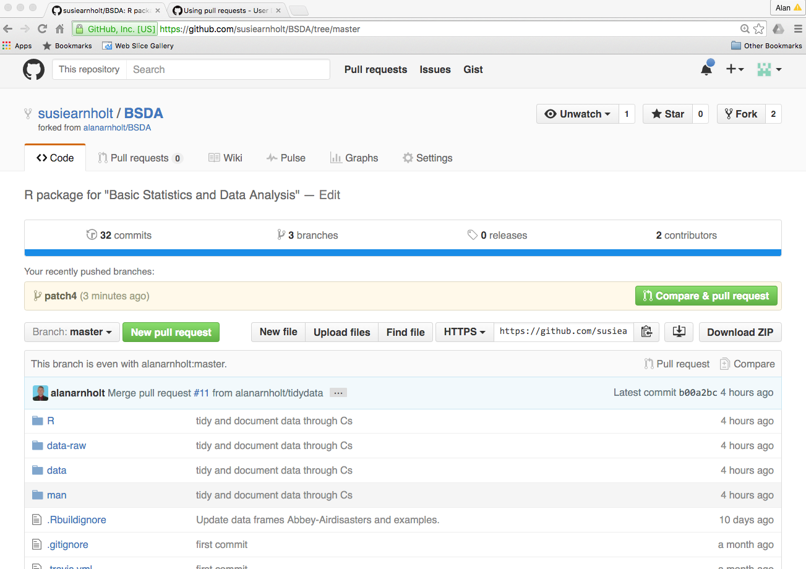
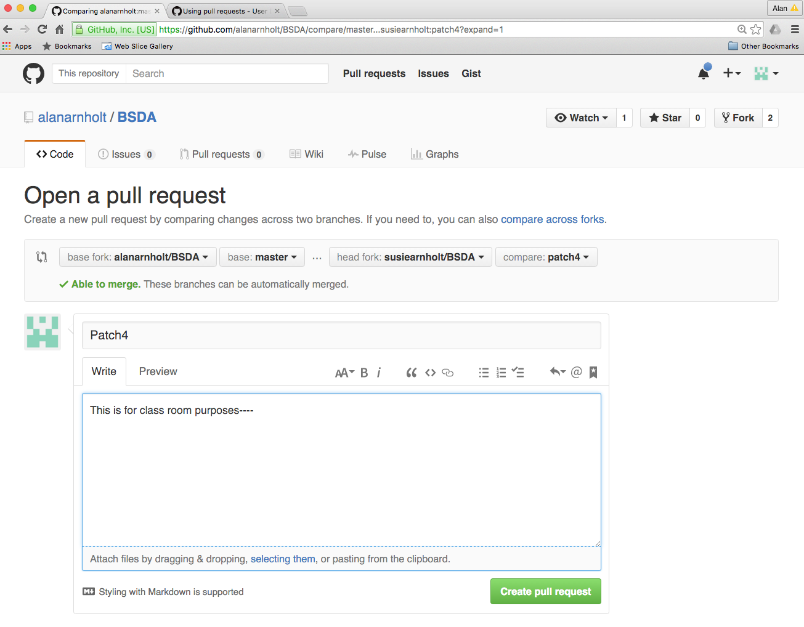
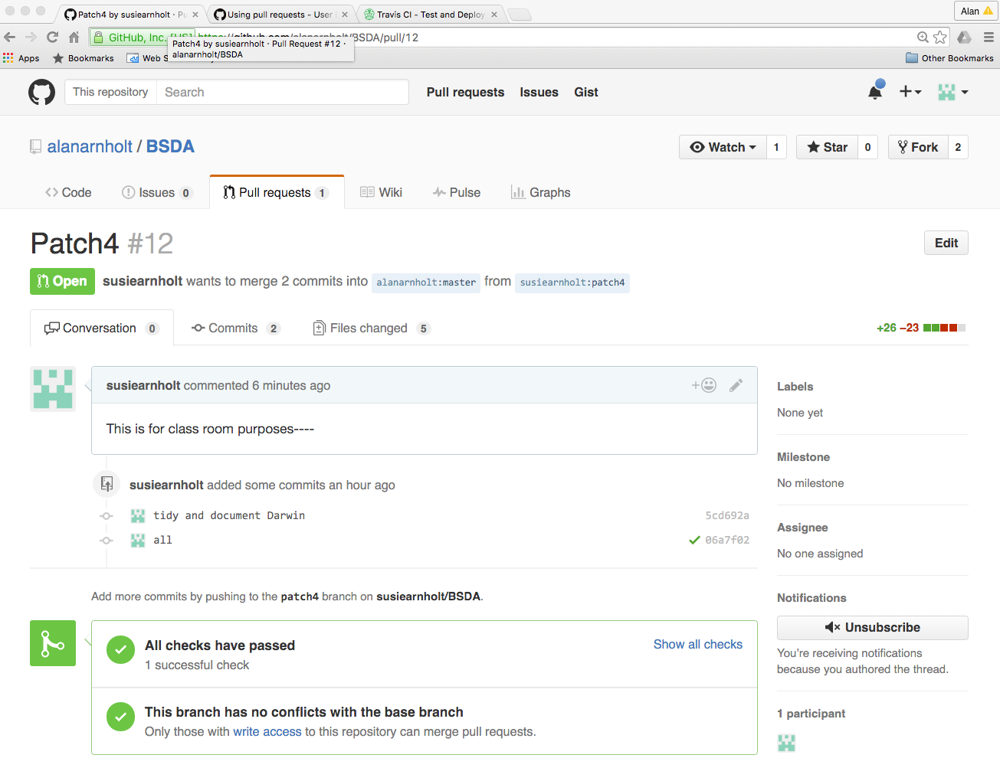
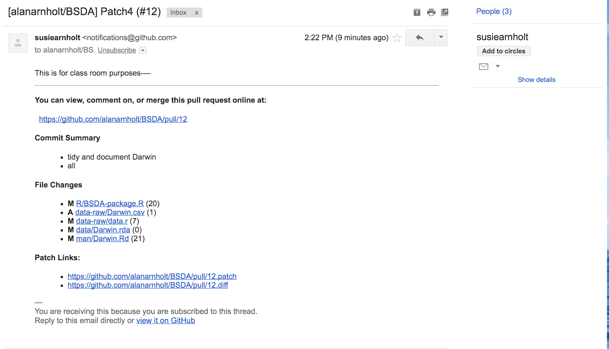

```{r, label = "SETUP", echo = FALSE, results= 'hide', message = FALSE, warning = FALSE}
knitr::opts_chunk$set(comment = NA, fig.align = 'center', fig.height = 5, fig.width = 5,  warning = FALSE, message = FALSE, tidy.opts=list(blank = TRUE, width.cutoff = 75))
```
---

# Working with others

This document assumes that you have a [GitHub](https://github.com/) account.  Suppose you want to contribute code to a particular GitHub maintained project (we will use the [`BSDA`](https://github.com/alanarnholt/BSDA) project as an example).

1.  [Fork](https://help.github.com/articles/fork-a-repo/) the repository of interest.
2.  Use [RStudio](https://www.rstudio.com/) to make a local copy of the `Project`. (Walk through in class)
3.  Hadley suggests creating a [branch](https://help.github.com/articles/about-branches/) when making code changes to both projects you control and those you do not control.  

To create a [branch](https://help.github.com/articles/about-branches/) open a shell and type:

```{r, engine = "bash", eval = FALSE}
git checkout -b newbranch-name
```

After issuing the last command with the `newbranch_name` (names should be in lowercase letters and numbers, with `-` used to separate words), make changes as normal.  Note that the push/pull icons in RStudio are disabled.  To enable them, you will first need to tell GitHub that your local branch has a remote equivalent by using the following:

```{r, engine = "bash", eval = FALSE}
git push --set-upstream origin newbranch-name
```

You should now be able to push any commits to your remote branch.  In this document, GitHub user `susiearnholt` created the branch `patch4` and pushed changes to her remote branch on GitHub. 



1. Switch to your branch (above the branch is `master` - we want `patch4`)



2. Make sure the `Branch:master` is even with `alanarnholt:master`. (See below) 

3. Click `Compare & pull request`



4. Click the `Create pull request`



5. If the project works with [Travis-CI](https://travis-ci.org/), make sure all checks pass.  The package `BSDA` uses Travis-CI.  The result is shown below.



6. GitHub automatically sends an email to the project owner (Me in this case) which is shown below.



7.  After some discussion, the project owner will click the `Merge pull request` button if the changes are approved.  Note that GitHub will ask you to confirm the merge before the transaction is complete.

##  Syncing your fork/branches

Once a pull request is honored, your fork and branches will be out of sync with the owners.  To sync your branches and fork, open a shell and type the following:

```{r, engine = "bash", eval = FALSE}
git remote add upstream <owner repo.git>
```

For this exercise, the repository of interest is `https://github.com/alanarnholt/BSDA.git`.

```{r, engine = "bash", eval = FALSE}
git remote add upstream https://github.com/alanarnholt/BSDA.git
git pull upstream master
```

At this point, you should click `pull` then `push`.  Your branch should be even with the owners.  Follow the same process to get the forked `master` in sync with the `owner/master`.

