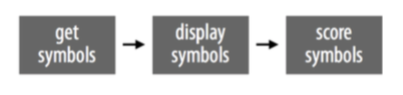
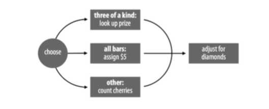
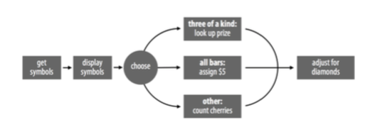
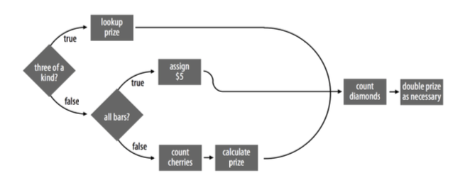

```{r, echo = FALSE, results= 'hide', message = FALSE, warning = FALSE}
set.seed(123)
library(knitr)
knitr::opts_chunk$set(comment = NA, fig.align = 'center', fig.height = 5, fig.width = 5, prompt = FALSE, highlight = TRUE, tidy = FALSE, warning = FALSE, message = FALSE, tidy.opts=list(blank = TRUE, width.cutoff= 75, cache = FALSE))
```

## Programs

```{r}
get_symbols <- function() {
  wheel <- c("DD", "7", "BBB", "BB", "B", "C", "0") 
  sample(wheel, size = 3, replace = TRUE,
  prob = c(0.03, 0.03, 0.06, 0.1, 0.25, 0.01, 0.52)) 
  }
get_symbols()
get_symbols()
get_symbols()
```

## Manitoba Slot Machine

The Manitoba slot machines use the complicated payout scheme shown in Table 1. A player will win a prize if he gets:

  1. Three of the same type of symbol (except for three zeroes)
  2. Three bars (of mixed variety)
  3. One or more cherries
  
Otherwise, the player receives no prize.  The monetary value of the prize is determined by the exact combination of symbols and is further modified by the presence of diamonds. Diamonds are treated like “wild cards,” which means they can be considered any other symbol if it would increase a player’s prize. For example, a player who rolls `7 7 DD` would earn a prize for getting three sevens. There is one exception to this rule, however: a diamond cannot be considered a cherry unless the player also gets one real cherry. This prevents a dud roll like, `0 DD 0` from being scored as `0 C 0`.

Diamonds are also special in another way. Every diamond that appears in a combination doubles the amount of the final prize. So `7 7 DD` would actually be scored higher than `7 7 7`. Three sevens would earn you $80, but two sevens and a diamond would earn you $160. One seven and two diamonds would be even better, resulting in a prize that has been doubled twice, or $320. A jackpot occurs when a player rolls `DD DD DD`. Then a player earns $100 doubled three times, which is $800.

```{r, echo = FALSE}
DF <- data.frame(Symbol1 = c("DD","7","BBB", "BB","B","C","AB","C","C","O","C","0","0"),
                 Symbol2 = c("DD","7","BBB", "BB","B","C","AB","C","0","C","0","C","0"),
                 Symbol3 = c("DD","7","BBB", "BB","B","C","AB","0","C","C","0","0","C"),
                 PayOut = c(100, 80, 40, 25, 10, 10, 5, 5, 5, 5, 2, 2, 2))
library(DT)
datatable(DF, rownames = FALSE,   caption = 'Table 1: Each play of the slot machine costs $1. A player’s symbols determine how much they win. Diamonds (DD) are wild, and each diamond doubles the final prize. 0 =  any symbol, and AB = any bar.')
```

To create your play function, you will need to write a program that can take the output of `get_symbols` and calculate the correct prize based on Table 1.  After that it will be easy to create the full slot machine, like this:

```{r, eval = FALSE}
play <- function() { 
  symbols <- get_symbols() 
  print(symbols) # See Note below
  score(symbols)
}
```

Note: The `print` command prints its output to the console window, which makes print a useful way to display messages from within the body of a function.

## Strategy

Scoring slot-machine results is a complex task that will require a complex algorithm. You can make this, and other coding tasks, easier by using a simple strategy:

  1. Break complex tasks into simple subtasks.
  2. Use concrete examples.
  3. Describe your solutions in English, then convert them to R.
  
Let's start by looking at how you can divide a program into subtasks that are simple to work with.  A program is a set of step-by-step instructions for your computer to follow. Taken together, these instructions may accomplish something very sophisticated. Taken apart, each individual step will likely be simple and straightforward.

You can make coding easier by identifying the individual steps or subtasks within your program. You can then work on each subtask separately. If a subtask seems complicated, try to divide it again into smaller subtasks that are even more simple. You can often reduce an R program into substasks so simple that each can be performed with a preexisting function.

R programs contain two types of subtasks: sequential steps and parallel cases.

## Sequential Steps

One way to subdivide a program is into a series of sequential steps. The play function takes this approach, shown below.



First, `play` generates three symbols (step 1), then it displays them in the console window (astep 2), and then it scores them (step 3):


```{r, eval = FALSE}
play <- function() {
  # step 1: generate symbols
  symbols <- get_symbols()
  # step 2: display the symbols
  print(symbols)
  # step 3: score the symbols
  score(symbols)
}
```

To have R execute steps in sequence, place the steps one after another in an R script or function body.

##Parallel Cases

Another way to divide a task is to spot groups of similar cases within the task. Some tasks require different algorithms for different groups of input. If you can identify those groups, you can work out their algorithms one at a time.

For example, score will need to calculate the prize one way if symbols contains three of a kind (In that case, `score` will need to match the common symbol to a prize). `score` will need to calculate the prize a second way if the symbols are all bars (In that case, `score` can just assign a prize of $5). And, finally, `score` will need to calculate the prize in a third way if the symbols do not contain three of a kind or all bars (In that case, score must count the number of cherries present). `score` will never use all three of these algorithms at once; it will always choose just one algorithm to run based on the com‐ bination of symbols.

Diamonds complicate all of this because diamonds can be treated as wild cards. Let’s ignore that for now and focus on the simpler case where diamonds double the prize but are not wilds. `score` can double the prize as necessary after it runs one of the following algorithms, as shown below.




Adding the score cases to the play steps reveals a strategy for the complete slot machine program, as shown below.




We’ve already solved the first few steps in this strategy. Our program can get three slot machine symbols with the `get_symbols` function. Then it can display the symbols with the `print` function. Now let’s examine how the program can handle the parallel score cases.

## `if` Statements

Linking cases together in parallel requires a bit of structure; your program faces a fork in the road whenever it must choose between cases. You can help the program navigate this fork with an `if` statement.

An `if` statement tells R to do a certain task for a certain case. In English you would say something like, "If this is true, do that." In R, you would say:

```{r, eval = FALSE}
if (this) {
  that
}
```

The this object should be a logical test or an R expression that evaluates to a single `TRUE` or `FALSE`. If this evaluates to `TRUE`, R will run all of the code that appears between the braces that follow the if statement (i.e., between the `{` and `}` symbols). If this evaluates to `FALSE`, R will skip the code between the braces without running it.

For example, you could write an `if` statement that ensures some object, `num`, is positive:

```{r eval = FALSE}
if (num < 0){
  num <- num * -1
}
```

If `num < 0` is `TRUE`, R will multiply num by negative one, which will make `num` positive:

```{r}
num <- -2
if (num < 0){
  num <- num * -1
}
num
```

If `num < 0` is `FALSE`, R will do nothing and num will remain as it is—positive (or zero):

```{r}
num <- 4
if (num < 0){
  num <- num * -1
}
num
```

The condition of an `if` statement must evaluate to a _single_ `TRUE` or `FALSE`. If the condition creates a vector of `TRUE`s and `FALSE`s (which is easier to make than you may think), your `if` statement will print a warning message and use only the first element of the vector. Remember that you can condense vectors of logical values to a single `TRUE` or `FALSE` with the functions `any` and `all`.

You don’t have to limit your if statements to a single line of code; you can include as many lines as you like between the braces. For example, the following code uses many lines to ensure that `num` is positive. The additional lines print some informative statements if `num` begins as a negative number. R will skip the entire code block—print statements and all—if `num` begins as a positive number:

```{r}
num <- -1
if(num < 0){
  print("num is negative.") 
  print("Don't worry, I'll fix it.") 
  num <- num * -1
  print("Now num is positive.")
}
num
```

## `else` Statements

`if` statements tell R what to do when your condition is true, but you can also tell R what to do when the condition is false. `else` is a counterpart to `if` that extends an `if` statement to include a second case. In English, you would say, “If this is true, do plan A; else do plan B.” In R, you would say:

```{r, eval = FALSE}
if (this) {
  Plan A
} else {
  Plan B
}
```

When this evaluates to `TRUE`, R will run the code in the first set of braces, but not the code in the second. When this evaluates to `FALSE`, R will run the code in the second set of braces, but not the first.

```{r}
a <- pi
a
dec <- a - trunc(a)
if(dec >= 0.5){
  a <- trunc(a) + 1
} else {
  a <- trunc(a)
}
a
```

If your situation has more than two mutually exclusive cases, you can string multiple `if` and `else` statements together by adding a new `if` statement immediately after `else`. For example:

```{r}
a <- 1
b <- 1

if(a > b){
  print("A wins!")
} else if (a < b) {
  print("B wins!")
} else {
  print("Tie.")
}
```

R will work through the if conditions until one evaluates to `TRUE`, then R will ignore any remaining `if` and `else` clauses in the tree. If no conditions evaluate to `TRUE`, R will run the final `else` statement.

If two `if` statements describe mutually exclusive events, it is better to join the `if` statements with an `else if` than to list them separately. This lets R ignore the second `if` statement whenever the first returns a `TRUE`, which saves work.

You can use `if` and `else` to link the subtasks in your slot-machine function. The code will be the skeleton of our final `score` function. Compare it to the flow chart for `score` shown below.


```{r, eval = FALSE}
if (# Case 1: all the same #1) {
  prize <- # look up the prize #2
  } else if (# Case 2: all bars #3) {    
    prize <- # assign $5 #4
    } else {
      # count cherries #5
      prize <- # calculate a prize #6
    }
# count diamonds #7
# double the prize if necessary #8
```

Our skeleton is rather incomplete; there are many sections that are just code comments instead of real code. However, we've reduced the program to eight simple subtasks:

  1. Test whether the symbols are three of a kind.
  2. Look up the prize for three of a kind based on the common symbol.
  3. Test whether the symbols are all bars.
  4. Assign a prize of $5.
  5. Count the number of cherries.
  6. Count the number of diamonds.
  7. Calculate a prize based on the number of cherries.
  8. Adjust the prize for diamonds.
  
If you like, you can reorganize your flow chart around these tasks, as shown below. The chart will describe the same strategy, but in a more precise way. I’ll use a diamond shape to symbolize an `if else` decision.



Now we can work through the subtasks one at a time, adding R code to the `if` tree as we go. Each subtask will be easy to solve if you set up a concrete example to work with and try to describe a solution in English before coding in R.

The first subtask asks you to test whether the symbols are three of a kind. How should you begin writing the code for this subtask?

You know that the final score function will look something like this:

```{r, eval = FALSE}
score <- function(symbols) {
      # calculate a prize
prize
}
```

Its argument, `symbols`, will be the output of `get_symbols`, a vector that contains three character strings. You could start writing score as I have written it, by defining an object named `score` and then slowly filling in the body of the function. However, this would be a bad idea. The eventual function will have eight separate parts, and it will not work correctly until all of those parts are written (and themselves work correctly). This means you would have to write the entire score function before you could test any of the subtasks. If score doesn't work—which is very likely—--you will not know which subtask needs fixed.

You can save yourself time and headaches if you focus on one subtask at a time. For each subtask, create a concrete example that you can test your code on. For example, you know that `score` will need to work on a vector named `symbols` that contains three character strings. If you make a real vector named `symbols`, you can run the code for many of your subtasks on the vector as you go:

```{r}
symbols <- c("7", "7", "7")
```

If a piece of code does not work on `symbols`, you will know that you need to fix it before you move on. You can change the value of `symbols` from subtask to subtask to ensure that your code works in every situation:

```{r, eval = FALSE}
symbols <- c("B", "BB", "BBB") 
symbols <- c("C", "DD", "0")
```

Only combine your subtasks into a `score` function once each subtask works on a concrete example. If you follow this plan, you will spend more time using your functions and less time trying to figure out why they do not work.

After you set up a concrete example, try to describe how you will do the subtask in English. The more precisely you can describe your solution, the easier it will be to write your R code.

Our first subtask asks us to "test whether the symbols are three of a kind." This phrase does not suggest any useful R code to me. However, I could describe a more precise test for three of a kind: three symbols will be the same if the first symbol is equal to the second and the second symbol is equal to the third. Or, even more precisely:

_A vector named `symbols` will contain three of the same symbol if the first element of `symbols` is equal to the second element of `symbols` and the second element of `symbols` is equal to the third element of `symbols`._

## Exercise

Turn the preceding statement into a logical test written in R. Use your knowledge of logical tests, Boolean operators, and subsetting from Chapter 4. The test should work with the vector `symbols` and return a `TRUE` if and only if each element in `symbols` is the same. Be sure to test your code on `symbols`.

Here are a couple of ways to test that symbols contains three of the same symbol. The first method parallels the English suggestion above, but there are other ways to do the same test. There is no right or wrong answer, so long as your solution works, which is easy to check because you’ve created a vector named `symbols`:
  
```{r}
symbols
symbols[1] == symbols[2] & symbols[2] == symbols[3]
symbols[1] == symbols[2] & symbols[1] == symbols[3]
all(symbols == symbols[1])
```

One method that I like for checking three of a kind is:

```{r}
length(unique(symbols)) == 1
```

The `unique` function returns every unique term that appears in a vector. If your `symbols` vector contains three of a kind (i.e., one unique term that appears three times), then `unique(symbols)` will return a vector of length 1.

Now that you have a working test, you can add it to your slot-machine script:

```{r, eval = FALSE}
same <- symbols[1] == symbols[2] && symbols[2] == symbols[3] # See comment below
if (same) {
  prize <- # look up the prize #2
  } else if (# Case 2: all bars #3) {    
    prize <- # assign $5 #4
    } else {
      # count cherries #5
      prize <- # calculate a prize #6
    }
# count diamonds #7
# double the prize if necessary #8
```

**Comment:** `&&` and `||` behave like `&` and `|` but can be more efficient.  The double operators will not evaluate the second test in a pair of tests if the first test makes the result clear. For example, if `symbols[1]` does not equal `symbols[2]` in the next expression, `&&` will not evaluate `symbols[2] == symbols[3]`; it can immediately return a `FALSE` for the whole expression (because `FALSE & TRUE` and `FALSE & FALSE` both evaluate to `FALSE`). This efficiency can speed up your programs; however, double operators are not appropriate everywhere. `&&` and `||` are not vectorized, which means they can only handle a single logical test on each side of the operator.

The second prize case occurs when all the symbols are a type of bar, for example, `B`, `BB`, and `BBB`. Let’s begin by creating a concrete example to work with:

```{r}
symbols <- c("B", "BB", "BBB")
```

## Exercise

Use R’s logical and Boolean operators to write a test that will determine whether a vector named `symbols` contains only symbols that are a type of bar. Check whether your test works with our example symbols vector. Remember to describe how the test should work in English, and then convert the solution to R.

As with many things in R, there are multiple ways to test whether `symbols` contains all bars. For example, you could write a very long test that uses multiple Boolean operators, like this:


```{r}
symbols[1] == "B" | symbols[1] == "BB" | symbols[1] == "BBB" &
symbols[2] == "B" | symbols[2] == "BB" | symbols[2] == "BBB" &
symbols[3] == "B" | symbols[3] == "BB" | symbols[3] == "BBB"
```

However, this is not a very efficient solution, because R has to run nine logical tests (and you have to type them). You can often replace multiple `|` operators with a single `%in%`. Also, you can check that a test is true for each element in a vector with `all`. These two changes shorten the preceding code to:

```{r}
all(symbols %in% c("B", "BB", "BBB"))
```

Let's add this code to our script:

```{r eval = FALSE}
same <- symbols[1] == symbols[2] && symbols[2] == symbols[3] 
bars <- symbols %in% c("B", "BB", "BBB")
if (same) {
  prize <- # look up the prize #2
  } else if (all(bars)) {    
    prize <- # assign $5 #4
    } else {
      # count cherries #5
      prize <- # calculate a prize #6
    }
# count diamonds #7
# double the prize if necessary #8
```

You may have noticed that I split this test up into two steps, `bars` and `all(bars)`. That’s just a matter of personal preference. Wherever possible, I like to write my code so it can be read with function and object names conveying what they do.

You also may have noticed that our test for Case 2 will capture some symbols that should be in Case 1 because they contain three of a kind:

```{r}
symbols <- c("B", "B", "B")
all(symbols %in% c("B", "BB", "BBB"))
```

That won't be a problem, however, because we've connected our cases with `else if` in the `if` tree. As soon as R comes to a case that evaluates to `TRUE`, it will skip over the rest of the tree. Think of it this way: each `else` tells R to only run the code that follows it if none of the previous conditions have been met. So when we have three of the same type of bar, R will evaluate the code for Case 1 and then skip the code for Case 2 (and Case 3).

Our next subtask is to assign a prize for `symbols`. When the `symbols` vector contains three of the same symbol, the prize will depend on which symbol there are three of. If there are three `DD`s, the prize will be $100; if there are three `7`s, the prize will be $80; and so on.

This suggests another `if` tree. You could assign a prize with some code like this:

```{r, eval = FALSE}
if (same) {
  symbol <- symbols[1] 
  if (symbol == "DD") {
    prize <- 800
  } else if (symbol == "7") {
    prize <- 80
  } else if (symbol == "BBB") {
    prize <- 40
  } else if (symbol == "BB") {
    prize <- 5
  } else if (symbol == "B") {
    prize <- 10
  } else if (symbol == "C") {
    prize <- 10
  } else if (symbol == "0") {
    prize <- 0
  }
}
```

While this code will work, it is a bit long to write and read, and it may require R to perform multiple logical tests before delivering the correct prize. We can do better with a different method.


## Lookup Tables

Very often in R, the simplest way to do something will involve subsetting. How could you use subsetting here? Since you know the exact relationship between the symbols and their prizes, you can create a vector that captures this information. This vector can store symbols as names and prize values as elements:

```{r}
payouts <- c("DD" = 100, "7" = 80, "BBB" = 40, "BB" = 25, "B"=10,"C"=10,"0"=0)
payouts
```

Now you can extract the correct prize for any symbol by subsetting the vector with the symbol's name:

```{r}
payouts["DD"]
payouts["BB"]
```

If you want to leave behind the symbol's name when subsetting, you can run the `unname` function on the output:

```{r}
unname(payouts["DD"])  # See comment below
```

**Comment:** `unname` returns a copy of an object with the names attribute removed.

`payouts` is a type of _lookup table_, an R object that you can use to look up values. Subsetting `payouts` provides a simple way to find the prize for a symbol. It doesn't take many lines of code, and it does the same amount of work whether your symbol is `DD` or `0`. You can create lookup tables in R by creating named objects that can be subsetted in clever ways.

Sadly, our method is not quite automatic; we need to tell R which symbol to look up in payouts. Or do we? What would happen if you subsetted payouts by `symbols[1]`? Give it a try:

```{r}
symbols <- c("7", "7", "7") 
symbols[1]
payouts[symbols[1]]
symbols <- c("C", "C", "C") 
payouts[symbols[1]]
```

You don't need to know the exact symbol to look up because you can tell R to look up whichever symbol happens to be in `symbols`. You can find this symbol with `symbols[1]`, `symbols[2]`, or `symbols[3]`, because each contains the same symbol in this case. You now have a simple automated way to calculate the prize when `symbols` contains three of a kind. Let's add it to our code and then look at Case 2:

```{r, eval = FALSE}
same <- symbols[1] == symbols[2] && symbols[2] == symbols[3] 
bars <- symbols %in% c("B", "BB", "BBB")
if (same) {
  payouts <- c("DD" = 100, "7" = 80, "BBB" = 40, "BB" = 25,
               "B"=10,"C"=10,"0"=0) 
  prize <- unname(payouts[symbols[1]])
} else if (all(bars)) {    
  prize <- # assign $5 #4
} else {
  # count cherries #5
  prize <- # calculate a prize #6
}
# count diamonds #7
# double the prize if necessary #8  
```

Case 2 occurs whenever the symbols are all bars. In that case, the prize will be $5, which is easy to assign:

```{r, eval = FALSE}
same <- symbols[1] == symbols[2] && symbols[2] == symbols[3] 
bars <- symbols %in% c("B", "BB", "BBB")
if (same) {
  payouts <- c("DD" = 100, "7" = 80, "BBB" = 40, "BB" = 25,
               "B"=10,"C"=10,"0"=0) 
  prize <- unname(payouts[symbols[1]])
} else if (all(bars)) {    
  prize <- 5 # assign $5 #4
} else {
  # count cherries #5
  prize <- # calculate a prize #6
}
# count diamonds #7
# double the prize if necessary #8  
```

Now we can work on the last case. Here, you'll need to know how many cherries are in `symbols` before you can calculate a prize.

## Exercise

How can you tell which elements of a vector named `symbols` are a `C`? Devise a test and try it out.

As always, let's work with a real example:

```{r}
symbols <- c("C", "DD", "C")
```

One way to test for cherries would be to check which, if any, of the symbols are a `C`:

```{r}
symbols == "C"
```

It would be even more useful to count how many of the symbols are cherries. You can do this with `sum`, which expects numeric input, not logical. Knowing this, R will coerce the `TRUE`s and `FALSE`s to `1`s and `0`s before doing the summation. As a result, `sum` will return the number of `TRUE`s, which is also the number of cherries:

```{r}
sum(symbols == "C")
```

You can use the same method to count the number of diamonds in `symbols`:

```{r}
sum(symbols == "DD")
```

Let's add both of these subtasks to the program skeleton:

```{r, eval = FALSE}
same <- symbols[1] == symbols[2] && symbols[2] == symbols[3] 
bars <- symbols %in% c("B", "BB", "BBB")
if (same) {
  payouts <- c("DD" = 100, "7" = 80, "BBB" = 40, "BB" = 25,
               "B"=10,"C"=10,"0"=0) 
  prize <- unname(payouts[symbols[1]])
} else if (all(bars)) {    
  prize <- 5 # assign $5 #4
} else {
  cherries <- sum(symbols == "C") 
  prize <- # calculate a prize    #6
}
diamonds <- sum(symbols == "DD")  #7
# double the prize if necessary   #8  
```

Since Case 3 appears further down the `if` tree than Cases 1 and 2, the code in Case 3 will only be applied to players that do not have three of a kind or all bars. According to the slot machine's payout scheme, these players will win $5 if they have two cherries and $2 if they have one cherry. If the player has no cherries, she gets a prize of $0. We don't need to worry about three cherries because that outcome is already covered in Case 1.

As in Case 1, you could write an `if` tree that handles each combination of cherries, but just like in Case 1, this would be an inefficient solution:

```{r, eval = FALSE}
if (cherries == 2) { 
  prize <- 5
} else if (cherries == 1) { 
  prize <- 2
} else { 
  prize <- 0
}
```

Again, I think the best solution will involve subsetting. If you are feeling ambitious, you can try to work this solution out on your own, but you will learn just as quickly by mentally working through the following proposed solution.

We know that our prize should be $0 if we have no cherries, $2 if we have one cherry, and $5 if we have two cherries. You can create a vector that contains this information. This will be a very simple lookup table:


```{r}
c(0, 2, 5)
```

Now, like in Case 1, you can subset the vector to retrieve the correct prize. In this case, the prize’s aren’t identified by a symbol name, but by the number of cherries present. Do we have that information? Yes, it is stored in cherries. We can use basic integer subsetting to get the correct prize from the prior lookup table, for example, Now, like in Case 1, you can subset the vector to retrieve the correct prize. In this case, the prize’s aren’t identified by a symbol name, but by the number of cherries present. Do we have that information? Yes, it is stored in cherries. We can use basic integer subsetting to get the correct prize from the prior lookup table, for example, c(0, 2, 5)[1].

```{r}
c(0, 2, 5)[1]
c(0, 2, 5)[2]
c(0, 2, 5)[3]
```

`cherries` isn’t exactly suited for integer subsetting because it could contain a zero, but that's easy to fix. We can subset with `cherries + 1`. Now when `cherries` equals two, we have:

```{r}
symbols <- c("C", "DD", "C")
cherries <- sum(symbols == "C") 
cherries
cherries + 1
c(0, 2, 5)[cherries + 1]
```

When `cherries` equals zero, we have:

```{r}
symbols <- c("B", "B", "DD")
cherries <- sum(symbols == "C")
c(0, 2, 5)[cherries + 1]
```

Examine these solutions until you are satisfied that they return the correct prize for each number of cherries. Then add the code to your script, as follows:

```{r, eval = FALSE}
same <- symbols[1] == symbols[2] && symbols[2] == symbols[3] 
bars <- symbols %in% c("B", "BB", "BBB")
if (same) {
  payouts <- c("DD" = 100, "7" = 80, "BBB" = 40, "BB" = 25,
               "B"=10,"C"=10,"0"=0) 
  prize <- unname(payouts[symbols[1]])
} else if (all(bars)) {    
  prize <- 5 # assign $5 #4
} else {
  cherries <- sum(symbols == "C") 
  prize <- c(0, 2, 5)[cherries + 1]    #6
}
diamonds <- sum(symbols == "DD")       #7
# double the prize if necessary        #8  
```

## Lookup Tables Versus `if` Trees

As a general rule, use an `if` tree if each branch of the tree runs different _code_. Use a lookup table if each branch of the tree only assigns a different _value_.


To convert an `if` tree to a lookup table, identify the values to be assigned and store them in a vector. Next, identify the selection criteria used in the conditions of the `if` tree. If the conditions use character strings, give your vector names and use name-based subsetting. If the conditions use integers, use integer-based subsetting.

The final subtask is to double the prize once for every diamond present. This means that the final prize will be some multiple of the current prize. For example, if no dia‐ monds are present, the prize will be:

```{r, eval = FALSE}
prize * 1             # 1 = 2 ^ 0
```

If one diamond is present, it will be:

```{r, eval = FALSE}
prize * 2              # 2 = 2 ^ 1
```

If two diamonds are present, it will be:

```{r, eval = FALSE}
prize * 4             # 4 = 2 ^ 2
```

And if three diamonds are present, it will be:

```{r, eval = FALSE}
prize * 8              # 8 = 2 ^ 3
```


Can you think of an easy way to handle this? How about something similar to these
examples?

## Exercise

Write a method for adjusting prize based on diamonds. Describe a solution in English first, and then write your code.

Here is a concise solution inspired by the previous pattern. The adjusted prize will equal:

```{r}
symbols <- c("C", "C", "DD")
###
same <- symbols[1] == symbols[2] && symbols[2] == symbols[3] 
bars <- symbols %in% c("B", "BB", "BBB")
if (same) {
  payouts <- c("DD" = 100, "7" = 80, "BBB" = 40, "BB" = 25,
               "B"=10,"C"=10,"0"=0) 
  prize <- unname(payouts[symbols[1]])
} else if (all(bars)) {    
  prize <- 5 # assign $5 #4
} else {
  cherries <- sum(symbols == "C") 
  prize <- c(0, 2, 5)[cherries + 1]    #6
}
diamonds <- sum(symbols == "DD")       #7
prize * 2 ^ diamonds                   #8
```

## Code Comments

You now have a working score script that you can save to a function. Before you save your script, though, consider adding comments to your code with a #. Comments can make your code easier to understand by explaining why the code does what it does. You can also use comments to break long programs into scannable chunks. 

```{r}
symbols <- c("C", "C", "DD")
# identify case
same <- symbols[1] == symbols[2] && symbols[2] == symbols[3] 
bars <- symbols %in% c("B", "BB", "BBB")

# get prize
# Case 1: all the same #1
if (same) {
  payouts <- c("DD" = 100, "7" = 80, "BBB" = 40, "BB" = 25,
               "B"=10,"C"=10,"0"=0) 
  # look up prize #2
  prize <- unname(payouts[symbols[1]])
  # Case 2: all bars #3
} else if (all(bars)) {    
  prize <- 5 # assign $5 #4
} else {
  # Count cherries
  cherries <- sum(symbols == "C") 
  # Calculate prize #6
  prize <- c(0, 2, 5)[cherries + 1]   
}
# adjust for diamonds
diamonds <- sum(symbols == "DD")       #7
prize * 2 ^ diamonds                   #8
```

Now that each part of your code works, you can wrap it into a function. Either use RStudio’s Extract Function option in the menu bar under Code, or use the `function` function. Ensure that the last line of the function returns a result (it does), and identify any arguments used by your function. Often the concrete examples that you used to test your code, like `symbols`, will become the arguments of your function. Run the following code to start using the score function:

```{r}
score <- function(symbols){
  # identify case
same <- symbols[1] == symbols[2] && symbols[2] == symbols[3] 
bars <- symbols %in% c("B", "BB", "BBB")
# get prize
# Case 1: all the same #1
if (same) {
  payouts <- c("DD" = 100, "7" = 80, "BBB" = 40, "BB" = 25,
               "B"=10,"C"=10,"0"=0) 
  # look up prize #2
  prize <- unname(payouts[symbols[1]])
  # Case 2: all bars #3
} else if (all(bars)) {    
  prize <- 5 # assign $5 #4
} else {
  # Count cherries
  cherries <- sum(symbols == "C") 
  # Calculate prize #6
  prize <- c(0, 2, 5)[cherries + 1]   
}
# adjust for diamonds
diamonds <- sum(symbols == "DD")       #7
prize * 2 ^ diamonds                   #8
}
```

Recall the `get_symbols` function:

```{r}
get_symbols <- function() {
  wheel <- c("DD", "7", "BBB", "BB", "B", "C", "0") 
  sample(wheel, size = 3, replace = TRUE,
  prob = c(0.03, 0.03, 0.06, 0.1, 0.25, 0.01, 0.52)) 
  }
```

Once you have defined the `score` function, the `play` function will work as well:

```{r}
play <- function(){
  symbols <- get_symbols()
  print(symbols)
  score(symbols)
}
```

Now it is easy to play the slot machine:

```{r}
set.seed(21)
play()
play()
play()
```

------------------

## Exercise --- Taken From _Probability and Statistics with R, Second Edition_

Pass line betting in bank/casino craps works as follows:  A player places a bet anywhere inside the area of the table marked PASS LINE and waits for the shooter (the person rolling the dice) to roll the dice.  The first roll the shooter takes is called the come out roll. If the come out roll (sum of the two dice) is either a 7 or an 11, all bettors win the amount of money they have placed in the PASS section of the table.  If the come out roll is a 2, 3, or 12 (crapping out), all bettors lose the amount of money they have placed in the PASS LINE section of the table.  

<p><a href="https://commons.wikimedia.org/wiki/File:Craps_table_layout.svg#/media/File:Craps_table_layout.svg"></a><br>By Betzaar.com - <a rel="nofollow" class="external free" href="http://betzaar.com/craps">http://betzaar.com/craps</a>, <a href="http://creativecommons.org/licenses/by-sa/3.0" title="Creative Commons Attribution-Share Alike 3.0">CC BY-SA 3.0</a>, https://commons.wikimedia.org/w/index.php?curid=12027168</p>

If the come out roll is any other number (4, 5, 6, 8, 9, or 10), then that number is called the shooter's point, and the shooter rolls the dice repeatedly until either a 7 or the shooter's point is rolled again.  If the shooter rolls a 7 before rolling point, all bets in the PASS LINE are lost.  If the shooter rolls point before rolling a 7, the bank/casino pays all bets in the PASS LINE to the players.  Write a function that simulates the outcomes from pass line betting in bank/casino craps.


 The function `SIMcraps` consists of two basic parts.  The first part is the function `linebet`, which simulates winning or losing a line bet in bank/casino craps.  The second part is a `for` loop that runs the function `linebet` a fixed number of times, then computes the percent of games out of the total number of games simulated that resulted in a win for the shooter.

```{r, label = "simcraps"}
SIMcraps <- function(n.games = 10000){
  opar <- par(no.readonly = TRUE)
  options(scipen=999)  # Suppress scientific notation in the output
  # linebet returns 0 or 1 based on whether 'shooter' loses or wins
  linebet <- function(){
    comeoutroll <- sum(sample(1:6, 2, replace = TRUE))  # first throw
    if (comeoutroll %in% c(7, 11)){
      result <- 1  # win if comeoutroll is 7 or 11
    } else if (comeoutroll %in% c(2, 3, 12)) {
      result <- 0  # loss if comeoutroll is 2, 3, or 12
    } else {
      repeat{
        substhrow <- sum(sample(1:6, 2, replace = TRUE))
        # subsequent throw
        if(substhrow == comeoutroll){
          result <- 1  # win if substhrow same as comeoutroll
          break
        } else if (substhrow == 7){
          result <- 0 # loss if substhrow is a 7
          break
        }
      }
    }
    result
  }
  gameOutcome <- numeric(n.games)  # vector of 0s of length n.games
  # Play n.games simulated crap games
  for(i in 1:n.games){gameOutcome[i] <- linebet()}    
  # gameOutcomes is a vector of wins and losses
  P.win <- mean(gameOutcome)       # Percent of time shooter wins
  Actual.answer <- 244/495
  Error <- round(abs(Actual.answer - P.win)/Actual.answer * 100, 4)
  cat("Simulated probability of winning =",  P.win, "based on",
      n.games, "simulated games.", "\n")
  cat("Percent simulation error based on actual answer 244/495 is ",
      Error,"%.", "\n", sep="")
  par(opar)
  options(scipen = 0)
}
```

Running the function:

```{r, label = "c01Simcraps2"}
set.seed(1234)  # setting seed for reproducibility
SIMcraps(n.games = 50000)
```

The actual answer is $244/495$.
