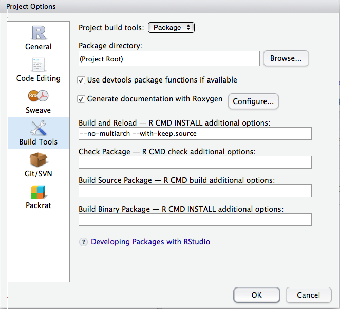
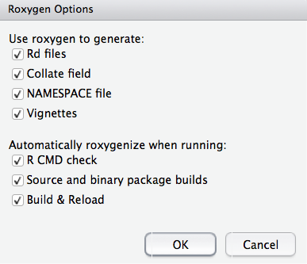
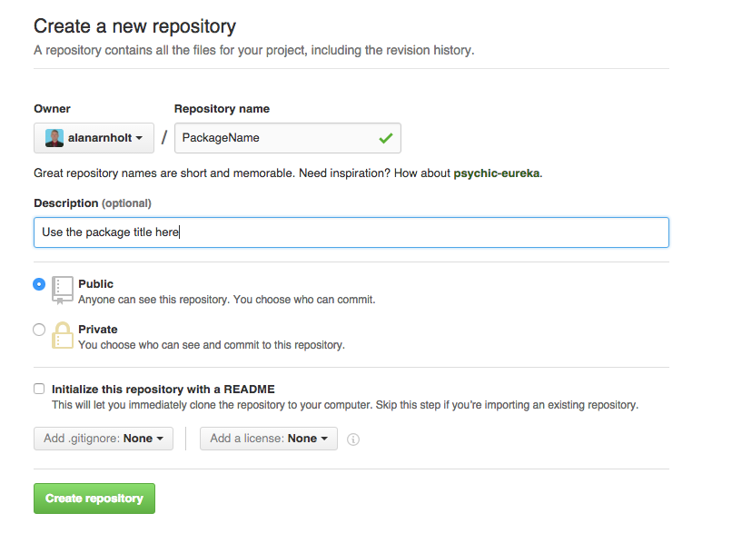
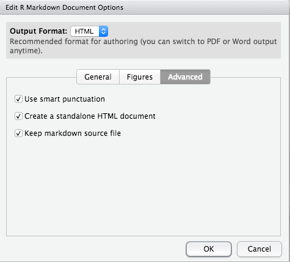

```{r, label = "SETUP", echo = FALSE, results= 'hide', message = FALSE, warning = FALSE}
knitr::opts_chunk$set(comment = NA, fig.align = 'center', fig.height = 5, fig.width = 5,  warning = FALSE, message = FALSE, tidy.opts=list(blank = TRUE, width.cutoff = 75))
```

Note: These are condensed notes primarily from Hadley Wickham's [*R packages*](http://r-pkgs.had.co.nz/) book.

## Create package structure

* File > New project > New directory > R package
* Fill in the Package name box (for example `MyPackage`)
* Add R files
* Decide where to store the package on your local machine
* Check the Create a git repository box

## Modify files

* Open and edit the DESCRIPTION file in the `MyPackage` directory.  The file should look something similar to what is shown below when complete.  There are four roles for authors:
  
  1. `cre` The creator or maintainer
  2. `aut` Author(s) who have made significant contributions to the package
  3. `ctb` Those who have made smaller contributions
  4. `cph` Copyright holder

```
Package: MyPackage
Type: Package
Title: What the Package Does (Title Case)
Version: 0.1.0
Date: 2016-01-31
Authors@R: c(person("Alan", "Arnholt", email = "arnholtat@appstate.edu", 
              role = c("aut", "cre")),
             person("Erin", "Kreiling", email = "kreilingeg@appstate.edu", 
              role = "aut"),
             person("Ben", "Jones", email = "jonesb@appstate.edu", 
              role = "aut"),
             person("Jack", "Leff", email = "leffjr@appstate.edu", 
              role = "ctb"))
Description: Describe what your package does. Make sure this description ends
    with a period.
Depends: R (>= 3.2.0)
License: GPL-2
LazyData: TRUE
```

* Document your R functions using `roxygen2`.  Your R code will be stored in the `R` directory.  Open your R files, place your cursor at the start of a function and select 

    + Code > Insert Roxygen Skeleton 
    
* Or use the short cut key strokes 

    + shift-control-command-R (MAC-keyboard)
    + shift-control-alt-R (PC-keyboard)
    
* Document your `package` using `roxygen2` - Create an store a file named `packageName.R` in the `R` directory.  The file should have fields similar to the one below. 

```
#' @description Miscelaneous functions for testing code in class.
#' @details Explain all kinds of stuff here.
#' @docType package
#' @name MyPackage-package
#' @title The most incredible editable MyPackage Package
#' @section My Custom Section: Add additional information here.
#' @keywords package
NULL
```

## Set Build Options

* Click the `build` tab > More > Configure build tools ...
* Make sure both the `Use devtools package functions if available` and the `Generate documentation with Roxygen` boxes are selected as shown below.



* Click the `Configure` box to the right of `Genereate documentation with Roxygen` and check all options as shown below.



## Build Package

* To build the package, click the `Build & Reload` button in the `Build` pane.
* To add a vignette, type `devtools::use_vignette("NameOfVignette")` at the R prompt.  Open the `NameOfVignette.Rmd` file (stored in the `vignettes` directory) and edit the template.
* Clicking `Build & Reload` does not build vignettes.  To create a package with vignettes, use:
    + `devtools::install("PkgName", build_vignette = TRUE)` (if installing from local files)
    + `devtools::install_github("YourGithubUsername/PkgName", build_vignette = TRUE)` (if installing from GitHub)

## Publishing on GitHub

* Create a new repository on GitHub [(https://github.com/new)](https://github.com/new) with the same name as your R package.  Include the package title as the description for the repository.  Leave all other options as is, then click `Create Repository`.



* Follow the directions on the new repository page for pushing an existing repository from the command line. The directions will be similar to the following with `YourGitHubUsername` containing your GitHub username.  Copy the commands and paste them at the prompt in a shell.

```
git remote add origin https://github.com/YourGitHubUsername/PackageName.git
git push -u origin master
```

* Modify the `DESCRIPTION` to add `URL` and `BugReports` fields that link to your new GitHub site.

* Save the `DESCRIPTION` file and commit your changes.

* Push your changes to GitHub.

* Create a README.md file using RMarkdown - Edit the RMarkdown options by selecting the down arrow next to the gear box > Output Options > Advanced > (check the) Keep markdown source file box as shown below.



* To keep the markdown source file, one may use the following in the YAML:

```
output: 
  html_document: 
    keep_md: yes
```

* Modify the `.gitignore` file to ignore README.Rmd and README.html

* Modify the `.Rbuildignore` file to ignore README.Rmd and README.html

* Commit and push changes

## Test Workflow

To set up your package to use `testthat`, run the following:

```{r, eval = FALSE}
devtools::use_testthat()
```

This will:

1. Create a `tests/testthat` directory
2. Add `testthat` to the `Suggests` filed in the `DESCRIPTION`.
3. Create a file `tests/testthat.R` that runs all your tests when `R CMD check` runs.

To test your package use either `Ctrl/Cmd-Shift-T` or `devtools::test()`.  For more guidance, see the Testing chapter of [*R packages*](http://r-pkgs.had.co.nz/tests.html).

## Adding Data to Your Package

There are three main ways to include data in your package, depending on what you
want to do with it and who should be able to use it:

* If you want to store binary data and make it available to the user, put it in `data/`.
This is the best place to put example datasets.  The easiest way to create an `.RData` file is to use `devtools::use_data()`.  The `use_data()` function creates a binary file and places the file in the `data/` directory of your package.

```{r, eval = FALSE}
SomeData <- rnorm(100)
use_data(SomeData, overwrite = TRUE)
```

Often, the data you include in `data/` is a cleaned-up version of raw data you’ve gathered from elsewhere. Hadley recommends taking the time to include the code used to do this in the source version of your package. This will make it easier for you to update or reproduce your version of the data. Hadley suggests that you put this code in `data-raw/`. You don’t need it in the bundled version of your package, so also add it to `.Rbuildignore`. You can do all this in one step with: `devtools::use_data_raw()`


* If you want to store parsed data, but not make it available to the user, put it in `R/sysdata.rda`. This is the best place to put data that your functions need.

* If you want to store raw data, put it in `inst/extdata`.  You may store raw data to show examples of loading/parsing raw (`.csv`, `.txt`, etc.) files.

### Documenting Data Sets

Objects in `data/` are always effectively exported. This means that they
must be documented. Documenting data is like documenting a function, with a few
minor differences. Instead of documenting the data directly, you document the name
of the dataset. For example, the `roxygen2` block used to document the `AGGRESSION` data
in `PASWR2` looks something like this:

```
#' @name AGGRESSION
#' @title TV and Behavior
#' @aliases AGGRESSION
#' @docType data
#' @description Data regarding the aggressive behavior in relation to exposure to violent television programs.
#' @format A data frame with 16 observations on the following two variables: 
#' \itemize{
#' \item \code{violence} (an integer vector)
#' \item \code{noviolence} (an integer vector)
#' }
#' @details This is data regarding aggressive behavior in relation to exposure to violent television programs from Gibbons (1997) with the following exposition: \dQuote{\ldots a group of children are matched as well as possible as regards home environment, genetic  factors, intelligence, parental attitudes, and so forth, in an effort to minimize factors other than TV that might influence a tendency for aggressive behavior.  In each of the resulting 16 pairs, one child is randomly selected to view the most violent shows on TV, while the other watches cartoons, situation comedies, and the like.  The children are then subjected to a series of tests designed to produce an ordinal measure of their aggression factors.} (pages 143-144)
#' @source Gibbons, J. D. (1977) \emph{Nonparametric Methods for Quantitavie Analysis}. American Science Press.
#' @references Ugarte, M. D., Militino, A. F., and Arnholt, A. T. 2015. \emph{Probability and Statistics with R}, Second Edition. Chapman & Hall / CRC.
#' @examples
#' with(data = AGGRESSION, 
#' wilcox.test(violence, noviolence, paired = TRUE, alternative = "greater"))
#' @keywords datasets
"AGGRESSION"
```

The data sets documented with `roxygen2` should be stored in the `R/` directory of your package just as the documentation for functions.

## Using Travis CI

[Travis](http://travis-ci.org) is a continuous integration service, which means that it runs automated testing code everytime you push to GitHub. For open source projects, Travis provides 50 minutes of free computation on a Ubuntu server for every push. For an R package, the most useful code to run is `devtools::check()`.

To use Travis:

1. Run `devtools::use_travis()` to set up a basic `.travis.yml` config file. If your `R` package doesn’t need any system dependencies beyond those specified in your `DESCRIPTION` file, your `.travis.yml` can simply be

```{r, eval = FALSE}
language: r
```

Using the package cache to store `R` package dependencies can significantly speed up build times and is recommended for most builds.

```{r, eval = FALSE}
language: r
cache: packages
```

Read the [Building an R Project with Travis CI](https://docs.travis-ci.com/user/languages/r) documentation for more information.


2. Navigate to your [Travis](https://travis-ci.org/) account (Click on your name in the top right of the screen > Accounts) and enable Travis for the repo you want to test.

3. Commit and push to GitHub.

Wait a few minutes to see the results in your email.

With this setup in place, every time you push to GitHub, and every time someone submits a pull request, `devtools::check()` will be automatically run. You’ll find out about failures right away, which makes them easier to fix. 


## Automagic Generation of `R` Package References

Suppose the following `R` packages are used for a project: `simplemathr`, `DT`, `ggplot2`, `ISLR`, `knitr`, `plotly`, and `rmarkdown`.  

1. Create an object named `PackagesUsed`.
2. Write the packages used to a `*.bib` file.
3. Load the packages with `lapply()`.
4. Add a `bibliography` entry to the YAML.
5. Cite the package using `@R-packagename` (look at the `*.bib` file for the exact name)
6. Add a `References` section header (`## References`) at the very end of the document.  The references will appear (provided they are cited) after the header.

```{r, eval = FALSE}
PackagesUsed <- c("simplemathr", "DT", "ggplot2", "ISLR", "knitr", "plotly", "rmarkdown")
# Write bib information
knitr::write_bib(PackagesUsed, file = "./PackagesUsed.bib")
# Load packages
lapply(PackagesUsed, library, character.only = TRUE)
```

Example YAML:

```
---
title: "Some Title"
author: "Alan Arnholt"
date: '`r format(Sys.time(), "%b %d, %Y")`'
bibliography: PackagesUsed.bib
output: html_document
---
```

```{r, echo = FALSE, message = FALSE, results = 'hide'}
PackagesUsed <- c("simplemathr", "DT", "ggplot2", "ISLR", "knitr", "plotly", "rmarkdown", "roxygen2")
# Write bib information
knitr::write_bib(PackagesUsed, file = "./PackagesUsed.bib")
# Load packages
lapply(PackagesUsed, library, character.only = TRUE)
```

This document uses `simplemathr` by @R-simplemathr, `DT` by @R-DT, `ggplot2` by @R-ggplot2, `ISLR` by @R-ISLR, `plotly` by @R-plotly, `rmarkdown` by @R-rmarkdown, `roxygen2` by @R-roxygen2, and `knitr` by @R-knitr.  

The previous line with citations was created using:

```
This document uses `simplemathr` by @R-simplemathr, `DT` by @R-DT, `ggplot2` by @R-ggplot2, `ISLR` by @R-ISLR, `plotly` by @R-plotly, `rmarkdown` by @R-rmarkdown, `roxygen2` by @R-roxygen2, and `knitr` by @R-knitr.  
```
## References

