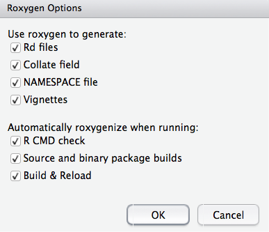
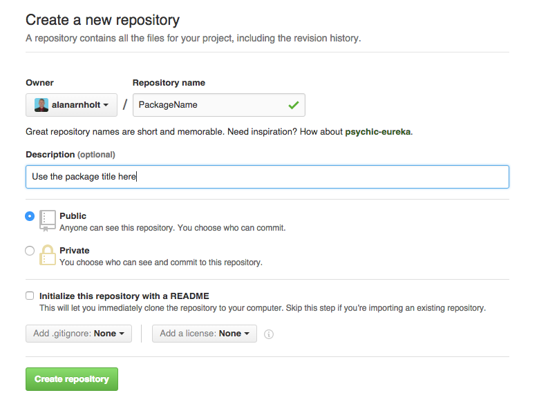
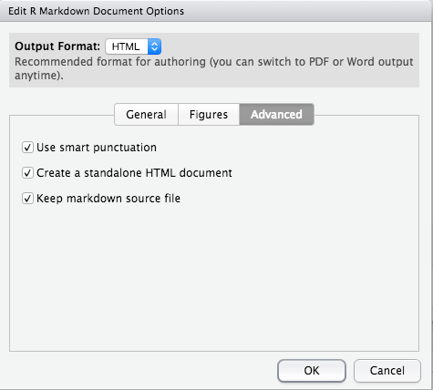

```{r, label = "SETUP", echo = FALSE, results= 'hide', message = FALSE, warning = FALSE}
knitr::opts_chunk$set(comment = NA, fig.align = 'center', fig.height = 5, fig.width = 5,  warning = FALSE, message = FALSE, tidy.opts=list(blank = TRUE, width.cutoff = 75))
```

## Create package structure

* File > New project > New directory > R package
* Fill in the Package name box (for example `MyPackage`)
* Add R files
* Decide where to store the package on your local machine
* Check the Create a git repository box

## Modify files

* Open and edit the DESCRIPTION file in the `MyPackage` directory.  The file should look something similar to what is shown below when complete.  There are four roles for authors:
  
  1. `cre` The creator or maintainer
  2. `aut` Author(s) who have made significant contributions to the package
  3. `ctb` Those who have made smaller contributions
  4. `cph` Copyright holder

```
Package: MyPackage
Type: Package
Title: What the Package Does (Title Case)
Version: 0.1.0
Date: 2016-01-31
Authors@R: c(person("Alan", "Arnholt", email = "arnholtat@appstate.edu", 
              role = c("aut", "cre")),
             person("Erin", "Kreiling", email = "kreilingeg@appstate.edu", 
              role = "aut"),
             person("Ben", "Jones", email = "jonesb@appstate.edu", 
              role = "aut"),
             person("Jack", "Leff", email = "leffjr@appstate.edu", 
              role = "ctb"))
Description: Describe what your package does. Make sure this description ends
    with a period.
Depends: R (>= 3.2.0)
License: GPL-2
LazyData: TRUE
```

* Document your R functions using `roxygen2`.  Your R code will be stored in the `R` directory.  Open your R files, place your cursor at the start of a function and select 

    + Code > Insert Roxygen Skeleton 
    
* Or use the short cut key strokes 

    + shift-control-command-R (MAC-keyboard)
    + shift-control-alt-R (PC-keyboard)
    
* Document your `package` using `roxygen2` - Create an store a file named `packageName.R` in the `R` directory.  The file should have fields similar to the one below. 

```
#' @description Miscelaneous functions for testing code in class.
#' @details Explain all kinds of stuff here.
#' @docType package
#' @name MyPackage-package
#' @title The most incredible editable MyPackage Package
#' @section My Custom Section: Add additional information here.
#' @keywords package
NULL
```

## Set Build Options

* Click the `build` tab > More > Configure build tools ...
* Make sure both the `Use devtools package functions if available` and the `Generate documentation with Roxygen` boxes are selected as shown below.


* Click the `Configure` box to the left of `Genereate documentation with Roxygen` and check all options as shown below.



## Build Package

* To build the package, click the `Build & Reload` button in the `Build` pane.
* To add a vignette, type `devtools::use_vignette("NameOfVignette")` at the R prompt.  Open the `NameOfVignette.Rmd` file (stored in the `vignettes` directory) and edit the template.
* Clicking `Build & Reload` does not build vignettes.  To create a package with vignettes, use:
    + `devtools::install("PkgName", build_vignette = TRUE)` (if installing from local files)
    + `devtools::install_github("YourGithubUsername/PkgName", build_vignette = TRUE)` (if installing from GitHub)

## Publishing on GitHub

* Create a new repository on GitHub [(https://github.com/new)](https://github.com/new) with the same name as your R package.  Include the package title as the description for the repository.  Leave all other options as is, then click `Create Repository`.



* Follow the directions on the new repository page for pushing an existing repository from the command line. The directions will be similar to the following with `YourGitHubUsername` containing your GitHub username.  Copy the commands and paste them at the prompt in a shell.

```
git remote add origin https://github.com/YourGitHubUsername/PackageName.git
git push -u origin master
```

* Modify the `DESCRIPTION` to add `URL` and `BugReports` fields that link to your new GitHub site.

* Save the `DESCRIPTION` file and commit your changes.

* Push your changes to GitHub.

* Create a README.md file using RMarkdown - Edit the RMarkdown options by selecting the down arrow next to the gear box > Output Options > Advanced > (check the) Keep markdown source file box as shown below.



* To keep the markdown source file, one may use the following in the YAML:

```
output: 
  html_document: 
    keep_md: yes
```

* Modify the `.gitignore` file to ignore README.Rmd and README.html

* Modify the `.Rbuildignore` file to ignore README.Rmd and README.html

* Commit and push changes


## Automagic Generation of `R` Package References

Suppose the following `R` packages are used for a project: `simplemathr`, `DT`, `ggplot2`, `ISLR`, `knitr`, `plotly`, and `rmarkdown`.  

1. Create an object named `PackagesUsed`.
2. Write the packages used to a `*.bib` file.
3. Load the packages with `lapply()`.
4. Add a `bibliography` entry to the YAML.
5. Cite the package using `@R-packagename` (look at the `*.bib` file for the exact name)
6. Add a `References` section header (`## References`) at the very end of the document.  The references will appear (provided they are cited) after the header.

```{r, eval = FALSE}
PackagesUsed <- c("simplemathr", "DT", "ggplot2", "ISLR", "knitr", "plotly", "rmarkdown")
# Write bib information
knitr::write_bib(PackagesUsed, file = "./PackagesUsed.bib")
# Load packages
lapply(PackagesUsed, library, character.only = TRUE)
```

Example YAML:

```
---
title: "Some Title"
author: "Alan Arnholt"
date: '`r format(Sys.time(), "%b %d, %Y")`'
bibliography: PackagesUsed.bib
output: html_document
---
```

```{r, echo = FALSE, message = FALSE, results = 'hide'}
PackagesUsed <- c("simplemathr", "DT", "ggplot2", "ISLR", "knitr", "plotly", "rmarkdown")
# Write bib information
knitr::write_bib(PackagesUsed, file = "./PackagesUsed.bib")
# Load packages
lapply(PackagesUsed, library, character.only = TRUE)
```

This document uses `simplemathr` by @R-simplemathr, `DT` by @R-DT, `ggplot2` by @R-ggplot2, `ISLR` by @R-ISLR, `plotly` by @R-plotly, `rmarkdown` by @R-rmarkdown, and `knitr` by @R-knitr.  

The previous line with citations was created using:

```
This document uses `simplemathr` by @R-simplemathr, `DT` by @R-DT, `ggplot2` by @R-ggplot2, `ISLR` by @R-ISLR, `plotly` by @R-plotly, `rmarkdown` by @R-rmarkdown, and `knitr` by @R-knitr.  
```
## References

