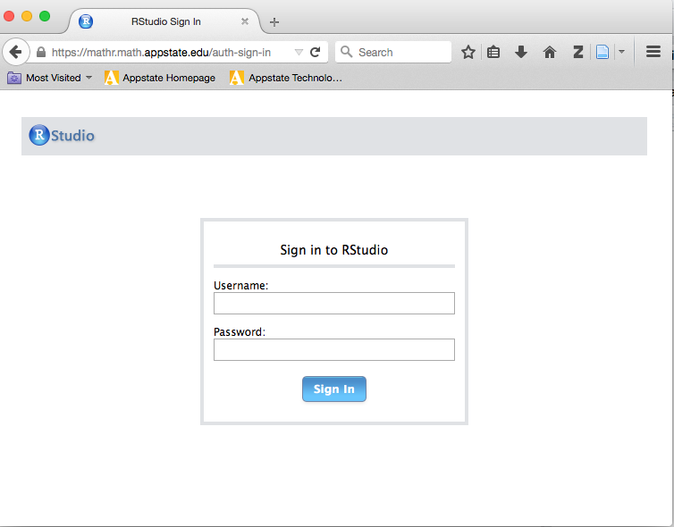

**Instructor:**  Dr. Alan T. Arnholt  
**Office:** Walker Hall 340      
**Office Hours:** 4:15-5:45 Tuesday, 4:15-5:45 Thursday, 8:30-10:00 Friday

Make an appointment to see me by clicking https://arnholtat.youcanbook.me/.

Questions related to the class should be addressed with the [piazza account for MAT 4010](https://piazza.com/class/ij30uq82d4p2di).

**Course Description:**  

This course covers programming with R and writing R packages.  Students will complete four projects during the semester and each project will be converted into an R package.    

**Course Objectives:**

1.  Students will use a reproducible research work flow.
2.  Students will improve their technology expertise.
3.  Students will learn how to write and document R functions using [roxygen2](https://cran.r-project.org/web/packages/roxygen2/).
4.  Students will learn how to create and maintain R packges on GitHub.

**Course Texts:**

[_Hands-On Programming with R_](http://www.amazon.com/Hands-On-Programming-Write-Functions-Simulations/dp/1449359019) by Garrett Grolemund

[_R Packages_](http://r-pkgs.had.co.nz/) by Hadley Wickham

**_Note:_** Both books are available as `SafariBooksOnline` through the Appalachian State University [library](http://library.appstate.edu/).  

**Optional References:**

[_Reproducible Research with R and RStudio, Second Edition_](https://github.com/christophergandrud/Rep-Res-Book) by Christopher Gandrud

[_R Graphics Cookbook_](http://www.amazon.com/R-Graphics-Cookbook-Winston-Chang/dp/1449316956) by Winston Chang - Available via `SafariBooksOnline` through the Appalachian State University [library](http://library.appstate.edu/). 

**Course Grading:**

* There are four programming assignments which will each count for 25% of the course grade.
* Up to 10 points may be added to your final course average for an excellent compilation of all homework assignments and class notes in a single hyperlinked `*.html` document. 

**Piazza:**

This term we will be using Piazza for class discussion. The system is highly catered to getting you help fast and efficiently from classmates and myself. Rather than emailing questions to the teaching staff, I encourage you to post your questions on Piazza. If you have any problems or feedback for the developers, email team@piazza.com.

Find our class page at: https://piazza.com/appstate/spring2016/mat4010/home

**How To Get Unstuck**

If you have a course related question, please ask your question on [piazza](https://piazza.com/class/ij30uq82d4p2di).  Your classmates may have the same question or may answer your question before I can provide an answer.  Well constructed questions will elicit answers more rapidly than poorly constructed questions.  This [video](https://www.youtube.com/watch?v=ZFaWxxzouCY&list=PLjTlxb-wKvXNSDfcKPFH2gzHGyjpeCZmJ&index=3) provides some background on asking questions.  This stackoverflow thread details how to create a [minimal R reproducible example](http://stackoverflow.com/questions/5963269/how-to-make-a-great-r-reproducible-example/5963610#5963610). Please read [How To Ask Questions The Smart Way](http://www.catb.org/~esr/faqs/smart-questions.html) by Eric Raymond and Rick Moen and heed their advice.

**University Policies**

This course conforms with all Appalachian State University policies with respect to academic integrity, disability services, and class attendance.  The details of the policies may be found at <http://academicaffairs.appstate.edu/resources/syllabi>.

**Computers and Software**

This course will use the RStudio server  (https://mathr.math.appstate.edu/) that has the programs listed below and more installed.

* [R](http://cran.r-project.org) 
* [Git](http://git-scm.com/downloads) 
* [RStudio](http://www.rstudio.com/products/rstudio/download/)
* [LaTeX](http://www.ctan.org/starter)

You must have an active internet connection and be registered in the course to access the server. To access the server, point any web browser to <https://mathr.math.appstate.edu/>.  You will need to acknowledge the connection is unsecure and possibly add a security exception to your web browser. Use your Appstate Username and Password to access the server.  A screen shot of the RStudio server is shown below.

If you have problems with your Appstate Username or Password visit [IT Support Services](http://support.appstate.edu/) or call 262-6266.  

#[Home Page](http://stat-ata-asu.github.io/MAT4010Spring2016/) - [Assignments](http://stat-ata-asu.github.io/MAT4010Spring2016/Assignments/MAT4010AssignmentsSpring2016.html) - [Piazza](https://piazza.com/class/ij30uq82d4p2di)
